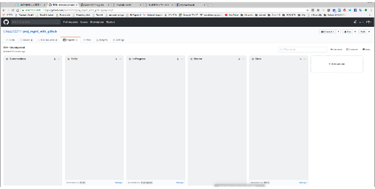
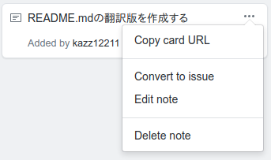
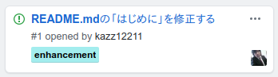

# Project Management with GitHub

## はじめに

このドキュメントはGitHubのプロジェクト機能（Projects）を使ってプロジェクト管理を行う方法を説明するものです。
目的はプログラマーやプロジェクト管理者が、実行中のタスクと問題点を把握することです。

アプリケーション仕様、テスト仕様、デプロイ仕様、運用仕様はGitHub内のWikiにまとめ、特段の理由がない限り他の形態のドキュメントは作らないか、作った場合はリポジトリに登録することとします。

個別の技術的課題（Issue）はIssuesの中で対応することとします。

文書はすべてMarkdown記法により記述ものとします。

## プロジェクトのメンバー構成

- プロジェクト管理者
- レビュー担当者
- プログラマー

## プロジェクトを始める

1. GitHubリポジトリの"Projects"タグを選んでプロジェクトページへ。

2. "New Project"を押して新規プロジェクトを作成。プロジェクトは開発・テスト・デプロイ・運用のように、開発フェーズ毎に分けて作成する。

3. ５つのボードを作る。
  - Conversation メモ、アイデア、提案など、プロジェクト内でやった方が良いと思われることを書く
  - To Do - Conversationからタスク化したものを置く
  - In Progress - 処理中のタスクを置く
  - Review - レビュー中のタスクを置く
  - Done - クローズ済みのタスクを置く

    

4. ボードのPreset設定
  - To Doの設定

    

  - In Progressの設定

    

  - Doneの設定

    

    これらの設定をすると、例えばIssueをクローズするとカードが自動的にDoneに移動し、IssueをRe-openするとカードが自動的にIn Progressにします。

プロジェクトを作成するのはプロジェクト管理者の仕事です。

## プロジェクトの運用

### 進捗確認

- 進捗確認は週に１回か２回程度。曜日を決める。通常、週に一回、月曜日か水曜日が妥当か。
- 進捗確認を行ったら次の進捗確認日をプロジェクトメンバーに周知する。

### プログラマーの作業

#### 随時

1. 何かあったらConversionボードにカードを追加する。
2. Conversationボードのカードからタスク化するものを選んで、To Doボードに移動する。
3. カードのNoteは適宜プログラマーがわかりやすい文言に修正する。
4. To Doボードに移動したカードから、次回の進捗確認日までに対応するカードをIssue化する。 (カード右上の「...」からメニューを開いて「Convert to issue」を選んでIssueとして登録する)

  

5. Issuesタブから該当のIssueを選んで担当者のアサインとラベル付けを行う。

  

  プロジェクトページに戻って担当者のアサインとラベル付けが行われたことを確認しておく。

  

#### 進捗確認日以降

1. To Doボードのカードを担当者自身がIn Progressボードに移動する。
2. In Progressボードのカードの内、対応済みのものをReviewボードに移動する。
3. レビュー担当者にレビューを依頼する

### レビュー担当者の作業

#### 進捗確認日

1. Reviewボードのカードのタスク（成果）をレビューし、
  - 問題があればIn Progressボードに移動して担当者に対応を依頼
  - 問題がなければIssueをクローズする。（Issueをクローズすれば自動的にDoneボードにカードが移動する）
2. 気がついたことは随時Conversationボードにカードを追加する。

### プロジェクト管理者の作業

1. Doneボードから削除しても構わないと思われるものを削除する。
２. In Progressボードのカードについて問題が起きていないかどうか担当者に確認する。
3. To Doボードのカードの中に急ぎのものがあれば担当者に依頼して対応を急いでもらう。
4. 気がついたことは随時Conversationボードにカードを追加する。
