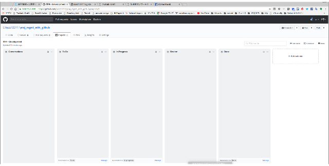
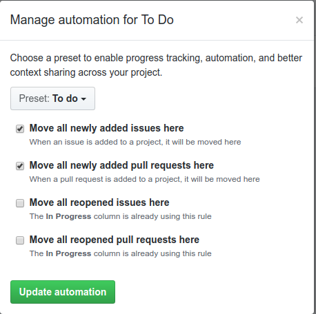
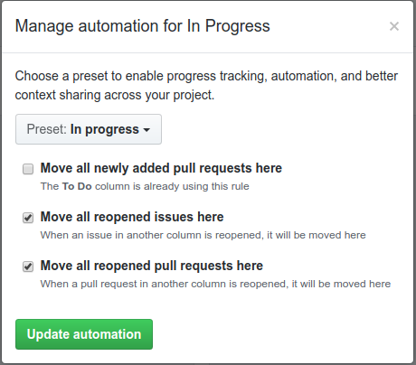
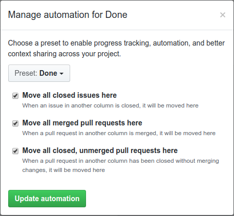
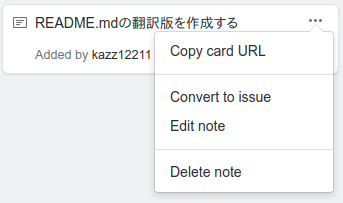
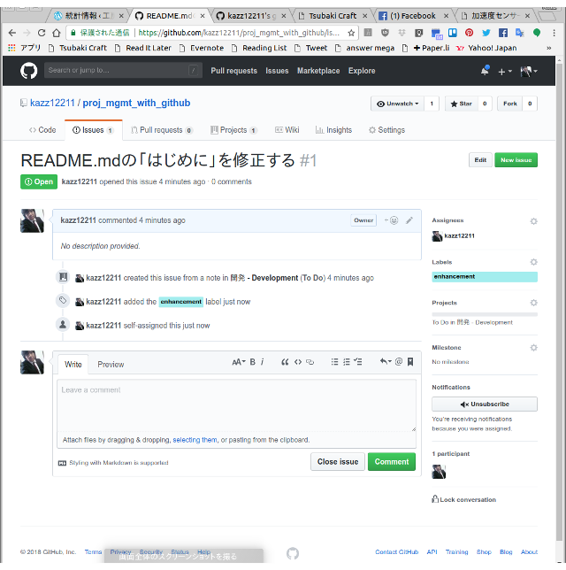
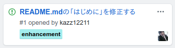

# Project Management with GitHub

## Introduction

This document explains the way of project management with GitHub projects. The pupose of project management for developers and project manager is to understand issues and progress of tasks.

For our project, the specifications of application, tesiting, deployment and operations should be described in GitHub Wiki of the application repository. We do not make documents of other forms unless there are special reasons.

Individual technical issues will be processed in GitHub Issues.

All documents shall be described by Markdown notation.

## Project members

- Project manager
- Reviewer or Tester
- Developers

## Starting project with GitHub Projects

1. Select the "Projects" tag of the GitHub repository and go to the project page.

2. Press "New Project" to create a new project. Projects should be created separately for each development phase, such as development, testing, deployment and operation.

3. Create 5 boards.
  - Conversation - Write down what you think is better to do in the project, such as memos, ideas, suggestions
  - To Do - Place task-oriented things from Conversation
  - In Progress - Place tasks in progress
  - Review - Place tasks in review process
  - Done - Place closed tasks

    

4. Setting Preset of boards
  - "To Do" Preset setting

    

  - "In Progress" Preset setting

    

  - "Done" Preset setting

    

    When these settings are made, for example, when Issue is closed, the card automatically moves to "Done", and when Issue is Re-opened, the card automatically becomes "In Progress".

Creating project is the job of the project manager.

## Project Management operations

### Progress confirmation

- The progress confirmation is about once or twice a week. Determine the day of the week. Normally, Monday or Wednesday is appropriate once a week.
- After confirming the progress, notify the project member of the next progress confirmation date.

### Developers' task

#### At any time

1. If you have something or something happens, add a card to the "Conversation".
2. Select the card to be converted to task on the "Conversation" board and move the card to the "To Do" board. At this time, it is advisable to set the granularity to such an extent that it can be completed by the progress confirmation date. If it is bigger than that, divide it to several cards.
3. The note of the card is corrected for programmers to understand easily.
4. Issue the corresponding card from the card in "To Do" board which should be handled by the next progress confirmation date. (Open the menu from "..." at the top right of the card, choose "Convert to issue" and register as Issue)

  

5. Select the Issue from the Issues tab and assign the person in charge and label.

  

  Go back to the "Projects" page and confirm that the assignee's assignment and labeling were done correctly.

  

#### After Progress Confirmation Date

1. The person in charge moves the card of the "To Do" board to the "In Progress" board.
2. Move the handled card of "In Progress" board to "Review" board.
3. Ask the reviewer to review the task.

### Reviewer's task

#### On Progress Confirmation Date

1. Review the tasks on the "Review" board,
  - If there is a problem, move the card to the "In Progress" board and ask the person in charge to respond
  - If there is no problem, close Issue on "Issues" page. (If you close Issue, the card will automatically move to the "Done" board)

#### At any time

1. If you have any idea, add cards to the "Conversation" board from time to time.

### Project Manager's task

#### At any time

1. Delete cards which you think you do not mind deleting from "Done" board.
2. Confirm with the person in charge if there is a problem with the card of "In Progress" board.
3. If there is anything you want to process in a hurry in the card of the "To Do" board, ask the person in charge to process in a hurry.
4. If you have any idea, add cards to the "Conversation" board from time to time.
