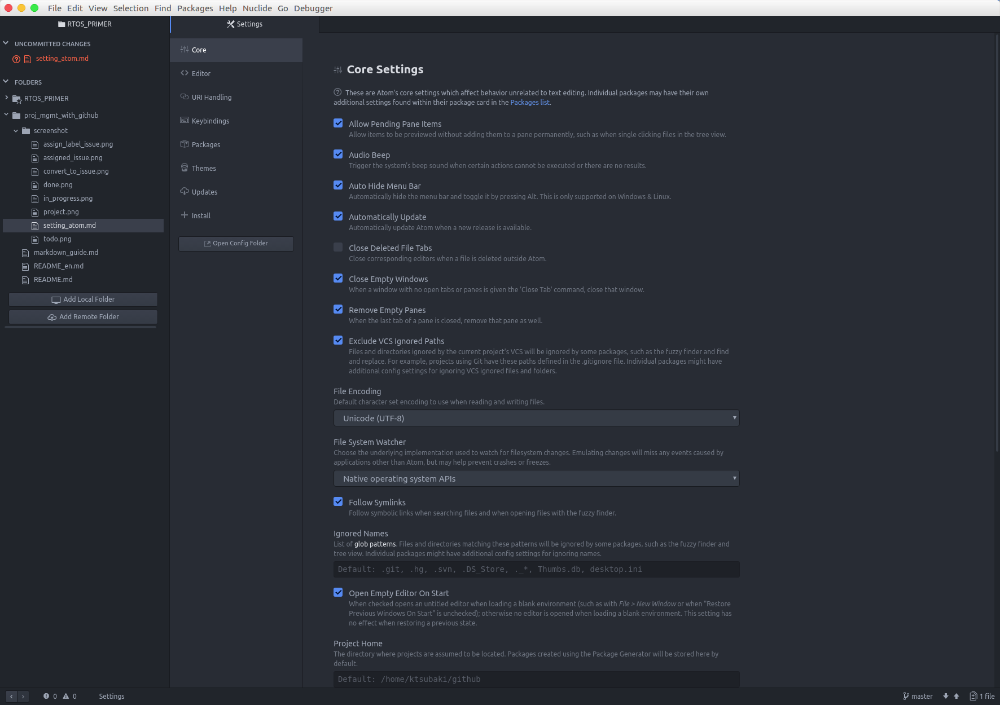
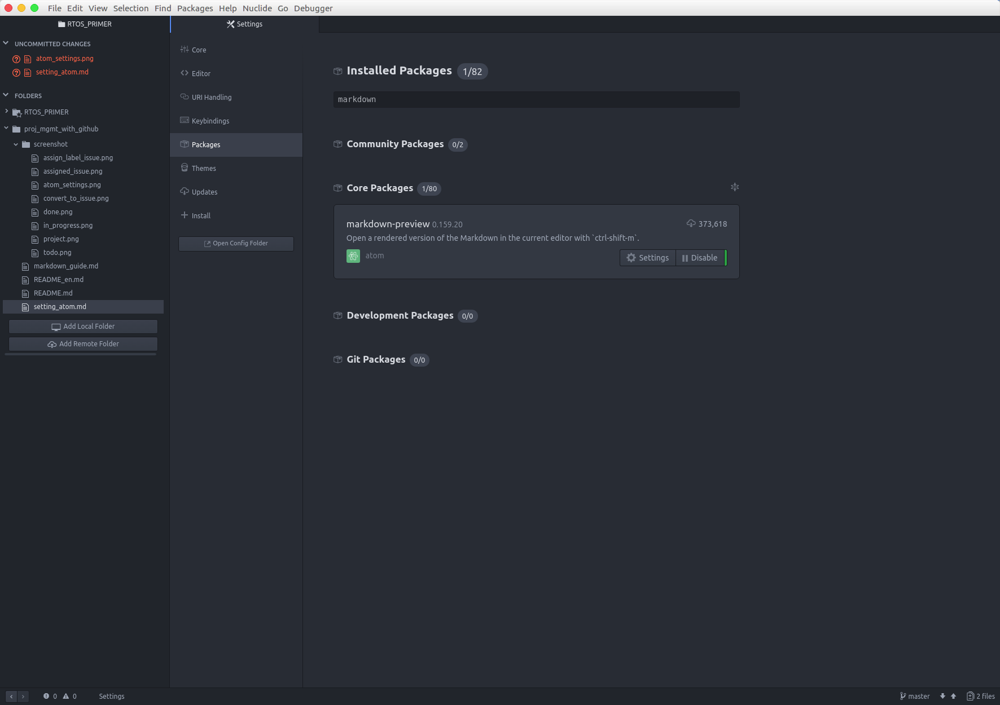
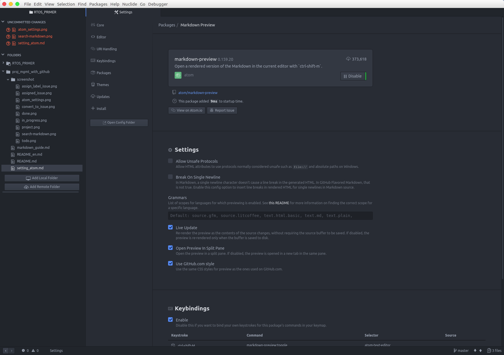

# Setting ATOM for GitHub

This document describes how to set GitHub style markdown preview of ATOM editor.

## Open preferences

Choose "Preferenes" menu item from "Edit" menu.

## Search markdown-preview package

Choose "Packages" section, then search "markdown-preview".

## Enable GitHub style of markdown-preview

Press "Setting" button of markdown-preview.

Enable "Use GitHub.com style".

